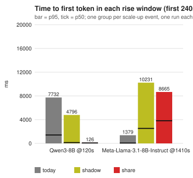
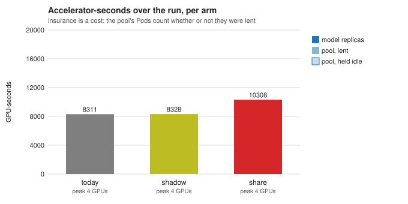
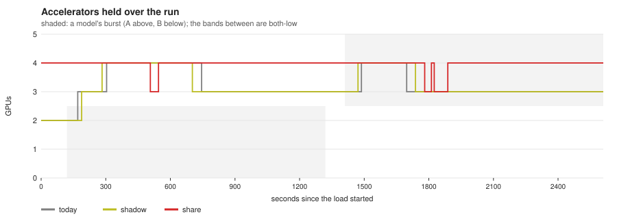

# What sharing one quota did, measured

[← Share one GPU quota between models whose peaks do not coincide](README.md)

Two models behind one gateway take turns at bursting, under **one** namespace
quota that is smaller than their two peaks together. The same traffic ran
three times, and only the policy's `optimizer:` block differed between the
runs:

- `today`: no block, so today's optimizer runs;
- `shadow`: the utilization-share optimizer computing and moving nothing;
- `share`: the same optimizer acting.

There was one run of each arm on H200 nodes, on 2026-10-08. The image was built
from `259c52f8` and deployed by digest. The scenario and the guards that keep
the arms comparable are in the
[benchmarking runbook](../../guides/benchmarking/two-model-utilization-share.md).
The tables below are that report's, unedited, except where a row says it came
from the controller log. Two later runs, on a scenario with different burst
shapes, follow in
[their own section](#different-burst-shapes-a-cancel-that-stalled-the-rising-model);
they found a failure the first scenario could not show. Every run used 1 GPU
per replica.

## The setup

| | |
| --- | --- |
| models | `unsloth/Meta-Llama-3.1-8B-Instruct` (A), `Qwen/Qwen3-8B` (B). Each has its own InferencePool and EPP, and each replica gets 1 × H200 |
| quota | `H200: 4`, one namespace quota for both models (`WVA_LIMITER=quota`) |
| bounds | each model 1–3 replicas in every arm. The two peaks together want 6, so the quota is binding |
| load | inference-perf, Poisson open-loop, 1000 in / 500 out tokens, synthetic prompts |
| rates | 3 rps between bursts. Bursts reach 9 rps for A and 8 rps for B, and A and B never burst at once |
| schedule | 120 s lead-in, B bursts for 1200 s, a 90 s band, then A bursts for 1200 s. That is 2610 s and 28 860 requests per arm |
| HPA | the shipped defaults: a 300 s scale-down window |

## What each arm held, through each rise

The fleet sampler records every replica and what its Deployment asked for every
5 s. Times are from the start of the rise.

| arm | Qwen (B) rises at 120 s | Llama (A) rises at 1410 s |
| --- | --- | --- |
| `today` | 1 at the rise; asked for 2 at +43 s, ready +127 s; 3 ready +257 s | asked for 2 at **+57 s**, ready +151 s |
| `shadow` | 1 at the rise; asked for 2 at +56 s, ready +138 s; 3 ready +239 s | asked for 2 at **+55 s**, ready +137 s |
| `share` | **2 at the rise**; 3 ready +501 s | asked for 2 at **+390 s**, ready +478 s; 3 ready +555 s |

Two mechanisms show here.

**Idle headroom goes to whoever rises first.** At idle, `share` hands the
quota's spare GPUs out as headroom, by weight. It raised both models from 1 to
2 before any burst began, so Qwen met its burst with a second replica already
serving. `today` started that burst from one replica and paid for two cold
starts while it was underway.

**At the swap, headroom has to be released before it can move.** By the time
Llama rose, `today` had already scaled Qwen down to what its load needed, so
Llama took a free GPU at once. `share` had kept Qwen at 3 as headroom, so Llama
could grow only through a transfer from Qwen. A transfer's release goes through
the donor's scale-down window. Llama started growing about **5.5 minutes later**
than under `today`.

## Time to first token

Per rise, in ms. Each row is ONE scale-up event, so the requests inside a
window are not independent samples of it:

| model | rise at | arm | served | failed | p50 | p95 | max |
| --- | ---: | --- | ---: | ---: | ---: | ---: | ---: |
| Llama | 1410 s | today | 2160 | 0 | 60 | 1379 | 2419 |
| Llama | 1410 s | shadow | 2160 | 0 | 2526 | 10231 | 11354 |
| Llama | 1410 s | share | 2160 | 0 | 3817 | 8665 | 10559 |
| Qwen | 120 s | today | 1920 | 0 | 1417 | 7732 | 8697 |
| Qwen | 120 s | shadow | 1920 | 0 | 135 | 4796 | 5499 |
| Qwen | 120 s | share | 1920 | 0 | 73 | 126 | 208 |

**Read `shadow` before `share`.** A shadow arm moves nothing, so it makes the
same decisions as `today`. On Llama's rise it held exactly the replicas `today`
held, at the same times, yet its p95 is 8.9 s higher; on Qwen's rise the two
differ by 2.9 s. That spread comes from serving, not from scaling, and up to
9 s p95 of it separates two arms that scaled identically. Every difference
between `share` and the other arms in this table is smaller than that, so
**this run does not say whether `share` helped or hurt latency** on either
rise. The numbers are kept as recorded; the replica table above, which shows
when the replicas came, is the evidence.

On Qwen's rise `share` had the lowest p95 (126 ms against 4.8 s and 7.7 s). That
is consistent with what the replica table shows, a second replica already
serving when the burst began, but in one run it is not a result on its own.

## Accelerators

| arm | GPU-seconds | peak GPUs |
| --- | ---: | ---: |
| `today` | 8311 | 4 |
| `shadow` | 8328 | 4 |
| `share` | 10308 | 4 |

`share` spent **24% more** GPU-seconds. That is the documented cost of the mode
and the reason not to take it where idle GPUs could be given back: it holds the
whole quota, idle or not.

## What the optimizer did

From the controller log of the `share` arm. Every transfer ended `done`: no
abort and no fill timeout. Whether the right pod went was not checked: the
benchmark install is namespace-scoped, so its transfers were planned by count,
and `wrong-pod` is detected only for transfers planned with node information. A
count-planned transfer is done when the donor shrinks by a replica, whichever
pod left.

| what | detail |
| --- | --- |
| idle fills | at the start, one replica each to Qwen and Llama from spare quota |
| Llama -> Qwen | when Qwen rose; released after about 6 min, then Qwen raised |
| Qwen -> Llama | two concurrent transfers when Llama rose, both released after about 5 min 45 s |
| Llama -> Qwen | one more started as Llama's burst ended, evening out headroom again |

Events on both Deployments named the pod that went and the reason, for
example *"giving one replica (1 GPUs) to model Qwen/Qwen3-8B (decode) to even
out headroom by weight; … goes"*. Two transfers from one donor were in flight at
once here, and both released, at about the same time. In the image this run
used, the two marks carried the same deletion cost, so the ReplicaSet's own
tie-break chose which pod went first. The controller now gives each later mark
a cost above the earlier live marks and below every unmarked sibling, so the
pods go in the order the transfers release.

The report's own transfer count, from `increase()` on
`wva_utilization_share_transfers_total`, read 2 where the log shows 3 transfers
plus the idle fills: in the image this run used, a counter series appeared at 1,
and `increase()` does not count a series' first sample. The controller now
publishes every outcome at 0 for an acting group, so later runs count the first
transfer of each outcome; for this run, count transfers from the log or the
Events. The `model-s held back` column is also `share`-only by construction:
today's optimizer emits no blocked reason when the quota is simply spent.

## What this says, and how far it goes

- **The mechanics work on real hardware.** Release came before the fill every
  time, and the Events said what happened. Which pod went was not checked (the
  install planned by count; see above).
- **Headroom by weight is insurance for the first rise, and a delay at the
  swap.** Here the delay was one donor scale-down window, 300 s, because
  headroom held by the falling model is only released through a transfer.
  Today's optimizer does not hold that headroom, so at the swap it was faster.
  A short scale-down window for urgent transfers is designed but not built (the
  proposal's stage 3), and it would address exactly this delay.
- **A move took about 8 minutes from the rise to a serving replica, not the
  design's twelve.** The proposal's decide-to-serve figure (§6.7) budgets two
  cycles to confirm, a 360 s release and a 180 s fill. Here the releases took
  about 5 min 45 s to 6 min, matching that budget, but the rest was shorter:
  Llama's Deployment asked for its second replica 390 s after the rise and had
  it ready at 478 s, an 8B model loading in about 90 s. A larger model, or a
  longer scale-down window, moves this toward the design figure or past it.
- **It costs GPU-seconds**: here 24%, and 66% on the second run with
  different burst shapes below. The cost depends on how much of the quota the
  load leaves idle, because the mode holds all of it.
- One run, two rises per arm, no repetition. The `today` and `shadow` arms
  disagree by up to 9 s p95 on identical decisions (2.9 s on Qwen's rise). A
  latency difference smaller than that is not a result. The replica timelines
  are.

## Different burst shapes: a cancel that stalled the rising model

A second scenario gave the two models different bursts: A (Llama) bursts on
20 000-token prompts with 250 tokens out at 4 rps, B (Qwen) on 1000-token
prompts with 6000 tokens out at 1 rps, with 0.25 rps between bursts. Each
model may reach 8 replicas, and one namespace quota of `H200: 10` covers both.
One run of each arm, on 2026-10-09, with the image of `4a5de336`. The two
ladders drifted up to about four minutes apart, so the bursts overlapped by
about two minutes and the report refused to compare the arms; the numbers
below are the load generator's own per-stage summaries, read directly.

| A's time to first token, p50 / p95 | `today` | `shadow` | `share` |
| --- | ---: | ---: | ---: |
| first 240 s of A's burst (960 requests) | 112 s / 134 s | 221 s / 254 s | 189 s / 401 s |
| rest of A's burst (3840 requests) | 1 s / 1 s | 1 s / 3 s | **575 s / 651 s** |

B stayed under a second in every arm, and every request was served.

- `today` and `shadow` decide the same way, and their first 240 s differ by
  2x: that is the spread of one run, not a result.
- In `share`, A gave B two replicas during B's burst. As A's own burst began,
  another A -> B transfer started, and was cancelled within a minute because
  A's demand had reversed. The cancel put both models in the reversal hold
  in the reverse direction: A could not receive and B could not give. So A ran
  its whole burst on 3 replicas while B, idle by then, held 7. The first
  transfer back started 16 minutes into A's burst, and landed after B's
  scale-down window.
- Fixed now, not yet measured: a cancelled transfer removes exactly its own
  recorded moves, so it holds neither model and counts toward no swing, and
  it holds only that donor -> receiver pair from starting again
  ([proposal §6.3](../../proposals/utilization-share-optimizer.md#63-execute-scale-down-first-scale-up-into-released-gpus)).
  The first attempt at this fix, in the image of the rerun below, restored a
  snapshot that confirming the transfer had already deleted, so on a cluster
  it did nothing. No run has measured the working fix.

### Rerun with the cancel fix: the reversal hold did the same

The same scenario on the image of `2eb607f9`, which carried the first,
ineffective cancel fix (no cancel happened in this run, so it did not matter),
with a 300 s band between bursts so the report could compare the arms (no
overlap in any arm). One run of each arm, on 2026-10-09.

| time to first token, p50 / p95 | `today` | `shadow` | `share` |
| --- | ---: | ---: | ---: |
| B (Qwen), first 240 s of its burst | 50 s / 81 s | 41 s / 92 s | **5 s / 58 s** |
| A (Llama), first 240 s of its burst | 113 s / 149 s | 219 s / 381 s | 178 s / 366 s |
| A (Llama), rest of its burst | 1 s / 1 s | 1 s / 3 s | **564 s / 754 s** |
| GPU-seconds | 16 976 | 17 599 | 28 111 |

No pod was ever unscheduled in any arm, and every request was served.

- Idle headroom worked for B: its burst began on 5 replicas instead of 1.
- A ran its whole burst on 3 replicas again, this time with no cancel
  involved. Two A -> B transfers started as B's burst ended (B's draining
  backlog of 6000-token outputs still read as need) and landed as A's burst
  began. A had just given and B had just received, so the reversal hold
  (about 11 minutes each) blocked the move back. The first B -> A transfer
  started 18 minutes into A's burst and landed after it ended.
- `share` spent 66% more GPU-seconds than `today` (28 111 against 16 976).
- Fixed now, not yet measured: a move that rebalances a hard imbalance waits
  for no reversal hold: a receiver whose load is at least 0.9 of its
  scale-up threshold and a donor whose load after giving is at most 0.6 of
  its own (`stabilization.skipWaitsWhen`)
  ([proposal §6.2](../../proposals/utilization-share-optimizer.md#62-plan-transfers)).
  An interim rule, a receiver below three quarters of its need, is gone. This
  run predates both; a rerun is next.
- Not fixed: B's draining backlog read as need, which is what started the
  transfers to it. The hard-imbalance rule lifts the hold only when the
  draining model's load after giving is at most 0.6. A model that must not start a burst
  short needs a floor sized for its burst.

## P/D: not measured

The same three arms were attempted on one P/D-disaggregated model
(`Qwen/Qwen3-0.6B`, prefill and decode each 1–4 replicas, a quota of 5). The
idea was for prefill and decode to compete for the quota through alternating
prompt-heavy and decode-heavy phases. In the `today` arm, decode scaled 1 -> 4
on the decode-heavy phase. **Prefill never left one replica**, including through
20 minutes of 15 000-token prompts at 12 rps. With no prefill demand there is
no prefill-versus-decode competition for the optimizer to resolve, so the
comparison would only have re-measured decode. It was not run.

Prefill does queue under such load, but the scaling manager reads that pressure
on decode, not as prefill demand. Until prefill has a demand signal of its own,
a P/D quota-sharing benchmark cannot exercise transfers between the two roles.
The attempt also found two problems in the benchmark tooling, both open:

- The standup rendered the scenario's Qwen3-32B resource requests (32 CPU /
  128 GiB per engine) despite logging the Qwen3-0.6B override. They were set
  by hand.
- The decode-heavy loader (4000-token outputs) wrote no results after its
  load ended, within the 1200 s grace.

A different P/D scenario now exists and has **not been run**:
`hack/benchmark/scenarios/guides/two-model-shapes-pd.yaml`, the
different-burst-shapes load with both 8B models disaggregated, so four roles
compete for one quota. Its prefill and decode pods take 1 GPU each, and it
shares an engine cache across replicas so only the first pod of each role
compiles. It exercises nothing about 8-GPU or whole-node pods.
